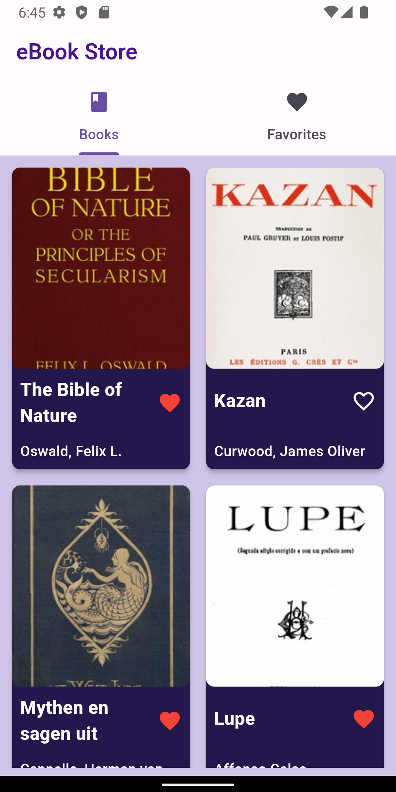
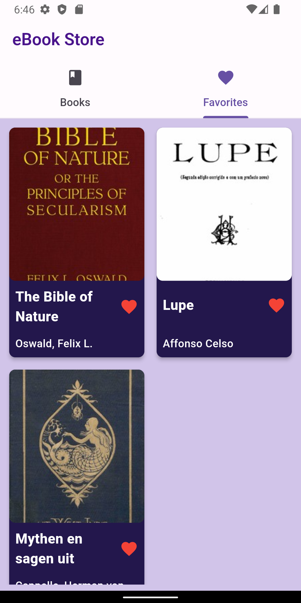
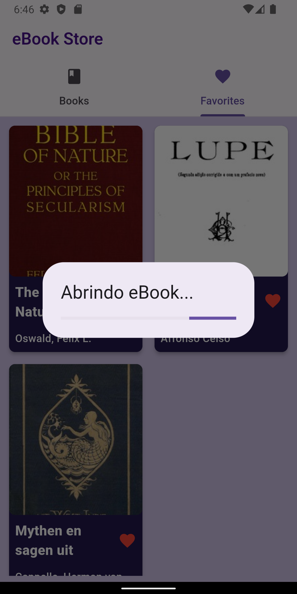

<h1 align="center">
Aplicação Teste
</h1>

<br>

<p align="center">
  
  <br>
  
  
</p>

<br>

# Clone e execute

Para clonar e executar esse app você precisará do [Git][git] + [Dart][dart] + [Flutter][flutter] instalados no seu computador.

```bash
# Clone esse repositório
$ git clone https://github.com/LeandroSimo/teste-escribo-mobile.git

# Entre no repositório
$ cd teste-escribo-mobile

# Instale as dependências
$ flutter pub get

# Execute
$ flutter run

```

<br>

PS.: Antente-se em abrir o seu emulador ou conectar um device antes de rodar o projeto.

[api]: https://reqres.in/
[git]: https://git-scm.com
[flutter]: https://flutter.dev/
[dart]: https://dart.dev/
